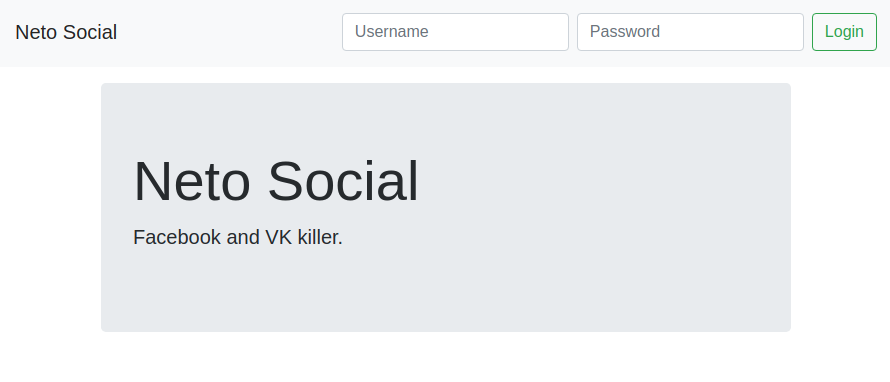
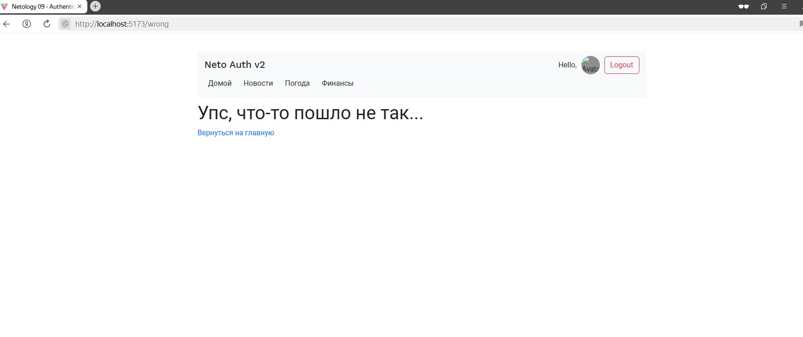

<a name="top"></a>

# Authentication v2

[вернуться в корневой readme](../readme.md)

- [Задание](#задание)
- [Решение](#решение)

## Задание

Вы решили модернизировать систему с аутентификацией, используя знания, полученные о роутере.  
Используя сервер, расположенный в каталоге backend, реализуйте приложение, удовлетворяющее следующим условиям:

1. При первой загрузке показывается лэндинг с формой входа (url = /):  


2. После авторизации (POST http://localhost:7070/auth {"username": "vasya", "password": "vasya"}), загружаются компоненты ленты новостей и в тулбаре отображается профиль с кнопкой выйти (url = /news):  


Для запроса профиля используйте запрос вида:  
```
GET http://localhost:7070/private/me
Authorization: Bearer <ваш_токен>
```

Для запроса новостей используйте запрос вида:  
```
GET http://localhost:7070/private/news
Authorization: Bearer <ваш_токен>
```

3. При нажатии на кнопку «Выйти» URL происходит редирект на главную страницу (url = /).  
4. Каждая новость кликабельна, при клике на новость открывается страница, на которой показана только карточка этой новости (url = /news/{id}).  
5. Если пользователь не аутентифицирован, то попытка зайти на /news или /news/{id} должна приводить к редиректу на главную страницу (url = /).

Важно:

Профиль и токен должны храниться в localStorage/sessionStorage. При перезагрузке страницы должна также загружаться лента новостей, если мы аутентифицированы.  
Должна быть обработка ошибок, если получена ошибка 401, то нужно разлогинивать пользователя и удалять всё из localStorage/sessionStorage.  
Должна быть обработка ошибок, если получена ошибка 404, например, пользователь в аутентифицированном режиме вручную вбил в адресную строку /news/00000000-0000-0000-0000-000000000000, то должна отрисовываться страница 404 — просто тулбар + большими буквами Not Found.  

[Вверх](#top)


## Решение

### BACKEND endpoints
Ну про то, что бэк использует ресурсы для картинок, доступные под тремя буквами, я молчу...

- POST /auth
  200 OK
  ```json
    {
      "token": "58d67998-7535-45ad-9917-316a0e276754"
    }
  ```
- GET /private/me
  200 OK or 401 Unauthorized
   ```json
      {
        "id": "9c7d638a-da75-4b72-941d-c6e243a0b65a",
        "login": "vasya",
        "name": "Vasya",
        "avatar": "https://i.pravatar.cc/40"
      }  
    ```
- GET /private/news with token
  200 OK or 401 Unauthorized
  ```json
  [
    {
      "id": "2906c4fe-f3c7-4a4b-beb8-09aa08c3dd56",
      "title": "место широкому деятельности",
      "image": "https://placeimg.com/640/480/nature",
      "content": "Нами на задания принимаемых отношении роль богатый работы. Таким повседневная и повседневная национальный консультация. Организационной широкому базы участниками играет напрямую количественный процесс формированию нас."
    },
    ...
  ]
  ```
- GET /private/news/:id with token
  200 OK or 401 Unauthorized
  ```json
    {
      "id": "2906c4fe-f3c7-4a4b-beb8-09aa08c3dd56",
      "title": "место широкому деятельности",
      "image": "https://placeimg.com/640/480/nature",
      "content": "Нами на задания принимаемых отношении роль богатый работы. Таким повседневная и повседневная национальный консультация. Организационной широкому базы участниками играет напрямую количественный процесс формированию нас."
    }
  ```
### Реализация

Использован Контекст и React Router 6. Приложение обернуто в Контекст и Роутер.

Реализовано приложение, состоящее из двух блоков - компонента Toolbar, изменяющегося в зависимости от состояния аутентификации, и компонента Outlet из состава библиотеки react-router, в котором рендерятся компоненты в зависимости от маршрута и состояния аутентификации.  
Реализованы защищенные маршруты как компонент ProtectedRoute, в который обернуты защищаемые компоненты.  
При попытке неаутентифицированного пользователя попасть по защищаемому маршруту его возвращает обратно на главную страницу по маршруту "/".  
Реализован компонент для страницы ленты новостей и компонент для страницы отдельной новости, эти маршруты защищены.  
Реализована обработка ошибки 404 - появляется страница с сообщением об ошибке и ссылкой на главную страницу.

Наполнение текстом отдано плагину lorem и библиотеке @faker-js/faker.  

Реализовано сохранение токена и профиля в locaStorage.

После логина в Toolbar форма входа меняется на блок с профилем, приложение переходит по маршруту /news.

После выхода из профиля происходит переход на главную страницу.

Скриншоты приложения:  
Главная страница:  


Переход аутентифицированного пользователя на вкладку "Новости" (маршрут /news):  


Переход аутентифицированного пользователя на страницу отдельной новости (маршрут /news/:id):  


Переход аутентифицированного пользователя по несуществующему маршруту:    


Переход неаутентифицированного пользователя по несуществующему маршруту:    


Требование проверки на ошибку 401 и разлогинивание выполнено следующим образом - в функции получения профиля и списка новостей добавлена проверка на код ответа 401, если он есть, то в этих функциях я выбрасываю исключение и ловлю его там, где вызываю эти функции. 
Но если у меня есть токен в localStorage, то я никак его не проверю - **у бэка нет API для этого**.
То есть если у меня в localStorage сохранен невалидный токен, то при попытке перехода на страницу новостей я получу от бэка ответ 401 и меня разлогинит и выкинет на главную. Но если у меня в localStorage сохранен еще и профиль, то на главную страницу я попаду и профиль тоже подгрузится из localStorage.


[Вверх](#top)