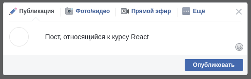
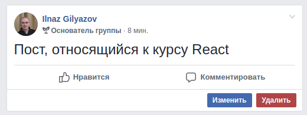
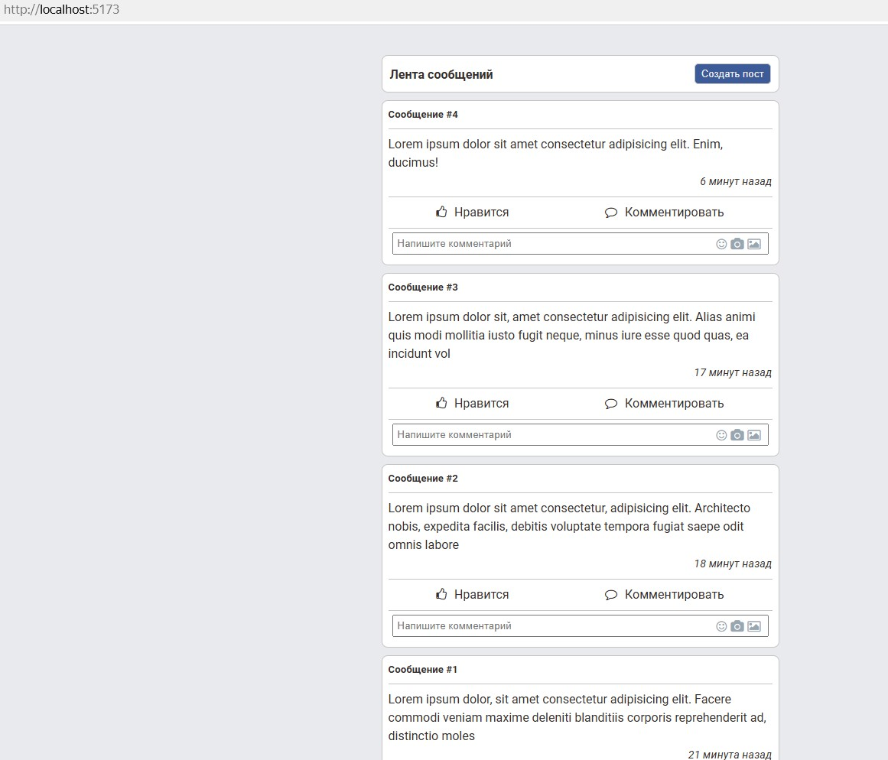
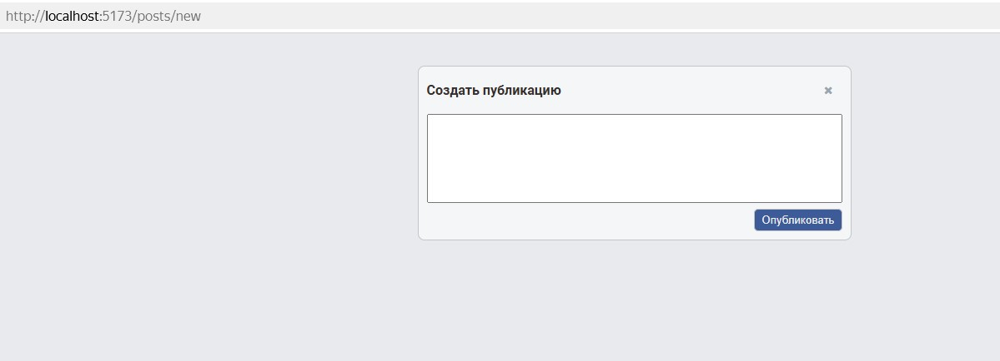
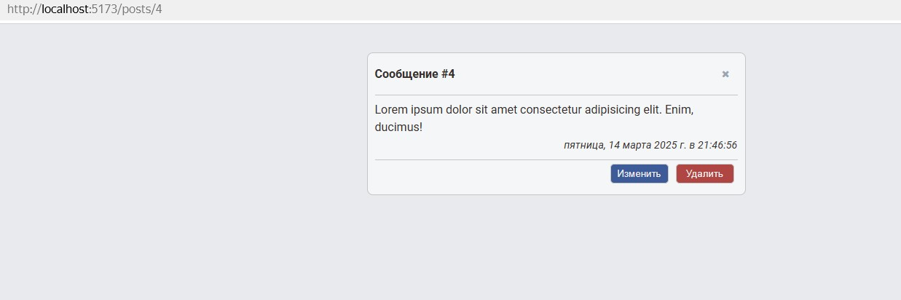
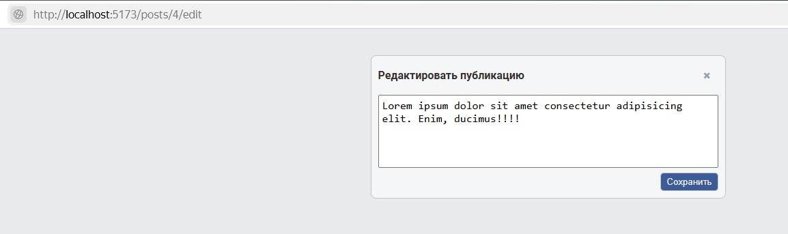
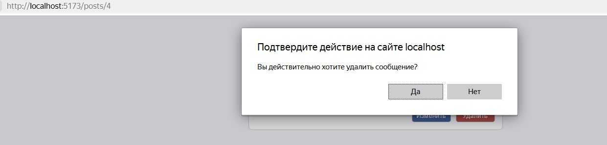
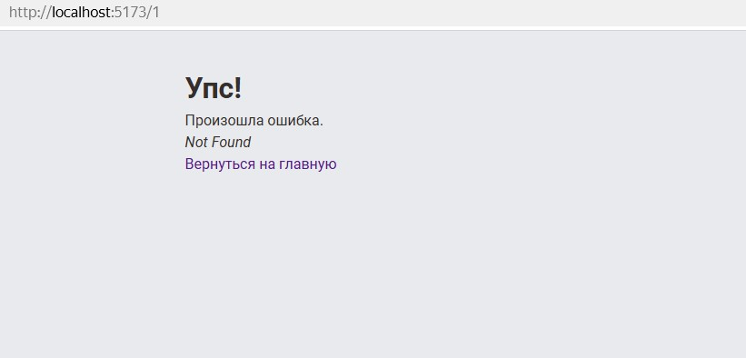

<a name="top"></a>

# CRUD

[вернуться в корневой readme](../README.md)

- [Задание](#задание)
- [Решение](#решение)

## Задание

Вам необходимо реализовать CRUD при работе с HTTP с использованием Router.

Backend вы можете либо написать сами, либо взять готовый из каталога **backend**.  


Нас интересует только ID, content и created, в качестве остальных значений вроде имени и фото, можете поставить заглушки.

### Общая механика

При нахождении на странице **/** отображается список существующих постов, GET на адрес http://localhost:7070/posts.  
Полученные данные отображаются в виде карточек:  


Кнопка «Создать пост» ведёт на страницу добавления (см. ниже) **/posts/new**. Помните про регулярные выражения.

При клике на саму карточку происходит переход на страницу просмотра поста (см. ниже) **/posts/{postId}**.

### Страница создания

На странице создания **/posts/new** отображается карточка создания:  


При нажатии на кнопку «Опубликовать» пост сохраняется, после чего осуществляется редирект на главную страницу.  
**POST** на адрес http://localhost:7070/posts
body:

```json
{
  "id": 0,
  "content": "То, что введено в поле ввода"
}
```

При нажатии на крестик в верхнем правом углу происходит редирект на главную без сохранения.  
Advanced: можете сохранить в localStorage и потом вытаскивать оттуда.

### Страница создания

На странице просмотра **/posts/{id}** отображается карточка просмотра:  


При клике на кнопку «Удалить» происходит удаление поста, после чего осуществляется редирект на главную страницу.  
**DELETE** на адрес **http://localhost:7070/posts/{id}**.

При клике на кнопку «Редактировать» карточка просмотра заменяется карточкой редактирования:  


На карточке редактирования:

- кнопка «Сохранить» приводит к сохранению поста и отображению карточки просмотра с обновлёнными данными.  
  **POST** на адрес http://localhost:7070/posts
  body:
  ```
  {
    "id": не 0,
    "content": "То, что введено в поле ввода"
  }
  ```
- кнопка крестик приводит к возврату к карточке просмотра.

[Вверх](#top)

## Решение

Реализовал как по туториалу от react-router.
Facebook, (упомянутый в оригинале ТЗ), принадлежит организации Meta, запрещенной в РФ.

### Backend

Ручки backend:

- GET /posts
- GET /posts/:id
- POST /posts
- PUT /posts/:id
- DELETE /posts/:id

По традиции в коде бэка упомянут process.env, но способ хранения переменной не указан.
Добавлен файл .env (в репозитории есть образец .env.sample)

#### Список постов

GET /posts/ отдает такое:

```json
[
  {
    "content": "Hello! This is my first post!",
    "id": 1,
    "created": 1741722269113
  },
  ...
]
```

#### Просмотр поста

GET /posts/:id отдает такое:

```json
[
  {
    "post": {
      "content": "Hello! This is my first post!",
      "id": 1,
      "created": 1741722269113
    }
  },
  ...
]
```

#### Создание поста

POST /posts/:id с телом:

```json
{
    "content": "Hello! This is my first post!"
}
```
ответ - 204

#### Редактирование поста

Почему в ТЗ на карточке редактирования пишут про POST, хотя бэк ловит PUT /posts/:id - неизвестно.  
PUT /posts/:id с телом:

```json
{ 
  "content": "Hello! This is my first post (updated)!"
}
```
ответ - 204

#### Удаление поста

DELETE /posts/:id  
ответ - 204

В коде фронтенда использован .env-файл для хранения переменной номера порта бэкенда 

Подключил статикой файлы Font Awesome 4.7 для иконок

### Реализация

Приложение реализовано на React Router 6.

При загрузке приложения по адресу "/" отображается "домашняя страница" Home c кнопкой создания сообщения и списком карточек сообщений.  
В карточке сообщения дата создания представлена в виде разницы между текущей датой и датой сообщения (например - "3 минуты назад", "1 час назад" )  



При клике на кнопке "Создать пост" приложение перенаправляет на страницу создания сообщения.  
На форме создания сообщения кнопкой с крестиком можно вернуться на главную страницу,  
при нажатии на кнопку "Опубликовать" сообщение отправляется на бэкенд и приложение перенаправляет на главную страницу, список сообщений обновляется.  


На Главной странице карточки сообщений обернуты в тег Link react-router'а, при клике по карточке приложение перенаправляет на страницу просмотра сообщения, где представлена полная информация о сообщении.
На этой странице у сообщения есть функционал изменения и удаления, также есть кнопка с крестиком для возврата на главную страницу.  
Клик по кнопке "Изменить" перенаправляет на страницу изменения сообщения.  
Клик по кнопке "Удалить" вызывает стандартный диалог confirm, в случае подтверждения сообщение удаляется и приложение перенаправляет на главную страницу.  


Страница изменения сообщения.  
По аналогии со страницей создания сообщения реализован функционал:  
при клике на кнопку с крестиком происходит возврат на главную страницу, 
при клике на кнопку "Сохранить" происходит отправка изменений на бэкенд и перенаправление на страницу просмотра сообщения.  


Функционал удаления сообщения  


Реализована страница с сообщением об ошибке при попытке перехода по несуществующему маршруту


Скринкаст функционала


[Вверх](#top)
