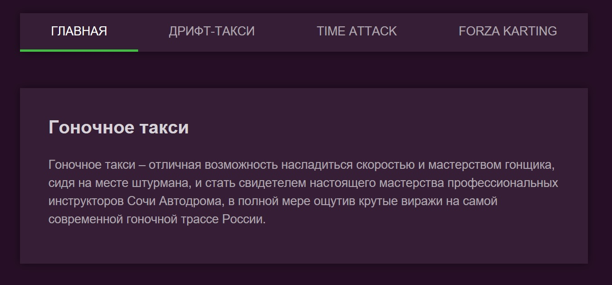

<a name="top"></a>
# Навигационное меню

[вернуться в корневой readme](../README.md)


- [Задание](#задание)
- [Решение](#решение)

## Задание
Необходимо реализовать меню для сайта гоночного такси с пунктами «Главная», «Дрифт-такси», «Time Attack» и «Forza Karting». При переходе на страницу соответствующий пункт меню должен подсветиться:


### Описание компонента
Компонент должен создавать HTML-разметку вида:
```html
<nav class="menu">
  <a class="menu__item" href="/">Главная</a>
  <a class="menu__item" href="/drift">Дрифт-такси</a>
  <a class="menu__item" href="/timeattack">Time Attack</a>
  <a class="menu__item" href="/forza">Forza Karting</a>
</nav>
```
Активный пункт меню помечается классом *menu__item-active*.

### Реализация
Необходимо реализовать компонент Menu.

Воспользуйтесь готовым файлом App.js и стилями css/index.css из каталога в качестве отправной точки. Замените ими те, что создаются в create-react-app.

Обратите внимание: в файлах App.js расположено несколько компонентов не потому, что так нужно делать, а чтобы вам было удобнее копировать. Будет хорошо, если в своём решении вы разнесёте их по разным файлам.

[Вверх](#top)

## Решение

Сначала смотрел на Outlet, но поскольку в задаче простая структура без вложенности, оставил Routes.

В приложении два крупных компонента - *Menu* с навигацией и *Main* с роутами.

Разметка Menu реализована почти по ТЗ (обернул меню в блок контейнера и header'a для семантики)
  

Скриншот корневой страницы приложения:


Скриншот другой страницы приложения (сделан в Хроме, чтобы был виден текущий URL):


[Вверх](#top)